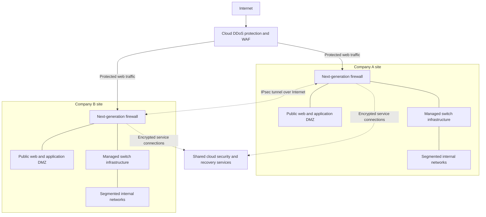

# Secure Merged Network Design Proposal

**Project type:** Academic network architecture case study  
**Status:** Proposed design; not a deployed or tested environment  
**First-year planning budget:** $50,000

## Overview

This project proposes a secure hybrid network following Company A's acquisition of Company B. Company A provides financial products, including checking accounts, bank cards, and investments. Company B develops software for medical providers and accepts credit-card payments.

The proposed architecture retains essential on-premises workloads and introduces cloud services for identity, security monitoring, backup, and public-facing application protection. It applies zero-trust principles: network location alone does not establish trust, and access must be authenticated and authorized. [1][2]

This report adapts the supplied *Secure Merged Network Design Proposal* into a GitHub-readable format. It documents architectural reasoning and proposed controls; it does not claim implementation, penetration testing, compliance certification, or verified vendor pricing.

## Contents

- [Business requirements](#business-requirements)
- [Security assessment](#security-assessment)
- [Proposed architecture](#proposed-architecture)
- [Network segmentation](#network-segmentation)
- [OSI and TCP/IP mapping](#osi-and-tcpip-mapping)
- [Security principles](#security-principles)
- [Compliance considerations](#compliance-considerations)
- [Emerging threats and performance](#emerging-threats-and-performance)
- [Infrastructure recommendation](#infrastructure-recommendation)
- [First-year budget](#first-year-budget)
- [Implementation approach](#implementation-approach)
- [Design limitations](#design-limitations)
- [Skills demonstrated](#skills-demonstrated)
- [References](#references)

## Business requirements

The merged organization needs to:

- Preserve required financial, software-delivery, and payment-processing functions.
- Integrate or consolidate overlapping capabilities and security tools.
- Combine on-premises infrastructure with scalable and resilient cloud services.
- Restrict access according to business need and verify identities.
- Protect customer information and payment-card data, and assess whether healthcare data obligations apply.
- Plan first-year implementation within a $50,000 allocation.

## Security assessment

The source proposal identifies the following design concerns. Several are conditional risks rather than confirmed scan findings. An omitted control in a diagram does not prove that the control is absent, and lack of dedicated staff does not establish that outsourced security services are missing.

| Area | Concern identified in the proposal | Potential business impact | Validation needed |
|---|---|---|---|
| Company A: DMZ access | Overly broad rules could allow a compromised public web server to reach internal financial systems. | Exposure or alteration of customer data and disruption of financial operations. | Review actual firewall rules, application dependencies, and permitted destinations. |
| Company A: detection and identity | The diagram does not establish the extent of centralized logging, MFA, EDR, or identity-based access controls. | Credential theft or endpoint compromise could go undetected and spread. | Inventory existing controls and verify coverage before declaring a gap. |
| Company B: device separation | Inadequately enforced separation among wireless clients, workstations, printers, and servers could enable lateral movement. | A compromised device could reach business applications or payment-related systems. | Review VLAN routing, access rules, device configuration, and segmentation tests. |
| Company B: security ownership | No dedicated cybersecurity role may create gaps unless third-party responsibilities are clearly defined. | Delayed remediation, missed alerts, and slower incident response. | Review provider contracts, monitoring coverage, escalation procedures, and accountable owners. |
| Availability and integration | Local infrastructure dependencies and overly permissive intersite connectivity could increase outage and breach impact. | Service interruptions and propagation of a compromise between sites. | Verify redundancy, recovery capability, tunnel rules, and existing equipment quantities. |

The proposal characterizes these exposures as significant, but final likelihood and risk ratings require evidence about configuration, exposure, existing controls, and business dependencies. In particular, the supplied Company B inventory lists two firewalls; a simplified drawing is not proof of a single-firewall deployment.

## Proposed architecture

The design uses site firewalls, managed switching, segmented local networks, and encrypted intersite connectivity. Shared cloud services provide identity, monitoring, and recovery functions. Public web services receive application-layer protection.

The following diagram is a **logical view**. Dotted links indicate service integrations or protected logical connections, not dedicated physical cables. Identity, monitoring, and backup services are not a serial transit path for all network traffic.

### Shared cloud capabilities

| Capability | Proposed purpose |
|---|---|
| Identity provider and MFA | Centralize authentication and verify access to integrated services. |
| SIEM and central log storage | Collect and correlate security events for investigation and alerting. |
| EDR management | Support endpoint detection and response through agents on protected devices. |
| Vulnerability management | Identify exposed weaknesses and track remediation. |
| Encrypted immutable backups | Protect recovery copies from unauthorized reading and modification. |
| WAF and DDoS protection | Filter malicious web requests and mitigate attacks against service availability. |
| DNS and email security | Reduce access to malicious destinations and delivery of malicious messages. |

The primary network policy is **deny by default**. Allow only documented business connections between segments and sites. An encrypted tunnel protects traffic in transit; it does not grant unrestricted access to the destination network.

## Network segmentation

The PDF proposes the following logical segmentation at each site. This table preserves that expanded design, including guest wireless and dedicated printer networks. A segment should only be implemented where the corresponding function is required.

| VLAN | Purpose | Intended access boundary |
|---|---|---|
| 10 | Corporate endpoints | Permit required business applications; restrict administrative access. |
| 20 | Internal servers | Limit access to approved users, services, and management paths. |
| 30 | Public web/application DMZ | Permit required public web traffic; restrict connections to internal systems. |
| 40 | Network management | Limit infrastructure administration to authorized administrators and management devices. |
| 50 | Guest wireless | Internet access only; block access to internal and remote-site networks. |
| 60 | Printers and IoT | Permit required printing or device functions; restrict management and outbound access. |
| 70 | Cardholder data environment | Restrict access to payment-related systems based on validated payment data flows. |
| 80 | Healthcare/ePHI systems, if applicable | Isolate systems handling ePHI if the organization's role and data flows establish that need. |

VLAN identifiers can repeat at separate sites, but routed IP subnets must not overlap. Segmentation requires enforced access rules and testing; VLAN labels alone do not establish isolation. Inter-VLAN routing must pass through the intended enforcement point rather than bypassing it through unrestricted Layer-3 switching.

## OSI and TCP/IP mapping

The mappings below distinguish device capabilities from the functions used in this design.

| Component or function | OSI layer | TCP/IP layer |
|---|---|---|
| Cables, fiber, and radio transmission | Layer 1: Physical | Network access / link |
| Ethernet switching, VLANs, and AP bridging | Layer 2: Data Link | Network access / link |
| Routing, Layer-3 switch routing, and IPsec | Layer 3: Network | Internet |
| Firewall IP and port filtering | Layers 3-4 | Internet and transport |
| Application-aware firewall inspection and WAF | Layer 7 application inspection, with underlying network functions as applicable | Application, plus underlying layers |
| Load balancing | Layer 4 or Layer 7, depending on configuration | Transport or application |
| Identity, MFA, SIEM, and backup services | Primarily Layer 7: Application | Application |
| Servers and endpoints | Full network stack; hosted services operate at the application layer | All layers; services at application |

## Security principles

### Least privilege and zero trust

Users and systems receive only the access necessary for their roles. An employee supporting healthcare software does not automatically receive access to payment systems, financial systems, or firewall administration. Authentication, authorization, and ongoing monitoring support the zero-trust approach described by NIST. [1][2]

Proposed implementation includes MFA, role-based access, restricted management paths, and narrowly scoped intersite rules. Device security checks and service integration must be specified during implementation; adding MFA alone does not establish a complete zero-trust architecture.

### Defense in depth

The design combines segmentation, MFA, endpoint protection, web application filtering, vulnerability management, monitoring, backups, and incident response. These controls address different stages of an attack. For example, a WAF may block a malicious request, segmentation may limit subsequent movement, and immutable backups may support recovery if prevention fails.

## Compliance considerations

### HIPAA, where applicable

Company B serves medical providers, but that fact alone does not establish HIPAA applicability. The organization must determine whether it creates, receives, maintains, or transmits ePHI in a regulated role. The healthcare segment in this proposal is conditional on that assessment.

If applicable, the proposed access restrictions, identity controls, encryption, audit logging, and recovery measures support safeguards for ePHI. HHS guidance describes technical safeguards such as access and audit controls. Network design must be accompanied by the relevant administrative and physical safeguards and operational evidence. [3][4][5]

### PCI DSS

Company B's payment-card acceptance makes payment security a relevant compliance consideration. The proposal uses a dedicated cardholder data environment (CDE), restricted firewall rules, and separation from general endpoints, printers, and guest devices.

PCI guidance describes how effective segmentation can isolate the CDE and potentially reduce assessment scope. Actual scope depends on payment flows and systems that can affect the CDE, and isolation must be validated. PCI DSS is an industry security standard; this design is not a compliance certification. [6]

The source PDF's compliance discussion is limited to HIPAA and PCI DSS. Financial-sector obligations for Company A, including the applicable GLBA safeguards, require a separate compliance assessment before implementation.

## Emerging threats and performance

| Threat scenario | Security risk | Potential operational or performance impact | Proposed management |
|---|---|---|---|
| AI-assisted phishing and identity attacks | Convincing messages or impersonation could lead to stolen credentials, fraudulent MFA approvals, or session theft. | Account containment can interrupt access; additional verification introduces sign-in steps and may add latency. | Phishing-resistant authentication where supported, conditional access, awareness training, identity logs, and endpoint detection. |
| Ransomware and data extortion | Attackers could encrypt systems, steal information, or attempt to destroy recovery copies. | Outages can interrupt financial services, medical-provider software, and payments. Backup restoration can consume substantial bandwidth and storage throughput. | Segmentation, patching, EDR, restricted privileges, immutable encrypted backups, and tested incident response and recovery procedures. |

These are planning scenarios discussed in the proposal, not measured findings from a deployed environment. VPN encryption, security inspection, log forwarding, and backup transfers also create resource demands. Capacity testing and scheduled backup windows should inform the final configuration.

## Infrastructure recommendation

A hybrid model preserves local workloads while adding shared cloud security and recovery capabilities.

| Option | Benefits | Costs and tradeoffs |
|---|---|---|
| On-premises infrastructure | Direct control, local access, and reuse of suitable existing equipment. | Hardware lifecycle costs, licenses, maintenance, power, staffing, and local disaster exposure. |
| Cloud services | Shared identity, centralized monitoring, off-site recovery, and capacity that can grow with demand. | Recurring subscriptions, consumption and transfer charges, Internet dependency, and provider configuration responsibilities. |
| Proposed hybrid approach | Combines existing local capacity with cloud-delivered security and backup services. | Requires coordinated identity, access rules, monitoring, support ownership, and cost management across environments. |

Reuse depends on vendor support, security capability, and capacity. Retaining equipment should not mean retaining unsupported software or unresolved vulnerabilities. Cloud services may reduce the need for additional local security infrastructure, but they do not eliminate internal oversight or incident-response responsibilities.

## First-year budget

The following allocation is reproduced from the source proposal. **It is a planning estimate, not a vendor quote or verified total cost of ownership.**

| Category | First-year allocation |
|---|---:|
| Identity management, MFA, and endpoint protection | $12,000 |
| Centralized logging, managed detection, and vulnerability scanning | $10,000 |
| Encrypted cloud backup and recovery testing | $8,000 |
| WAF, DNS security, and email protection | $7,000 |
| Firewall upgrades, segmentation, and secure VPN configuration | $8,000 |
| Professional services, documentation, training, and incident-response testing | $5,000 |
| **Total** | **$50,000** |

Final pricing depends on user and endpoint counts, existing subscriptions, log volume, backup capacity, retention, bandwidth, implementation labor, and required replacements. The allocation uses the entire budget and contains no separate contingency. Recurring costs after year one must also be evaluated.

## Implementation approach

The following sequence organizes the proposal into reviewable phases; these steps have not been executed.

1. **Validate the environment.** Inventory assets, subscriptions, dependencies, regulated data flows, support status, and third-party responsibilities.
2. **Confirm scope and costs.** Select services, obtain pricing, and define which existing capabilities are retained, replaced, or consolidated.
3. **Establish access controls.** Integrate identity, enforce MFA, remove unnecessary privileges, and document required connections.
4. **Implement segmentation and connectivity.** Configure site networks, DMZ rules, and restricted encrypted tunnels. Validate both allowed and denied paths.
5. **Deploy monitoring and recovery.** Integrate endpoint protection, security logs, web protection, and encrypted immutable backups.
6. **Test and document.** Verify business services, restore representative workloads, measure performance, and rehearse incident response.

## Design limitations

- This is an academic proposal; no deployment results, test evidence, or production metrics are claimed.
- Proposed subnet assignments, hardware models, subscription tiers, recovery objectives, and retention periods still require definition.
- Remote-worker access, existing EDI/file-transfer workflows, and detailed application dependencies must be explicitly preserved or replaced.
- The proposed guest wireless and printer segmentation follow this PDF and differ from earlier working diagrams.
- HIPAA applicability and payment-system scope require confirmation. Other financial-sector and jurisdictional requirements remain to be assessed.
- Availability and risk conclusions require validation against the original inventories, assessments, and actual configurations.
- The security-service diagram illustrates relationships, not physical placement or a finalized packet-by-packet traffic path.

## Skills demonstrated

- Hybrid network architecture and merger planning
- VLAN segmentation, DMZ design, and firewall policy reasoning
- IPsec connectivity and least-privilege access design
- Cloud identity, monitoring, and recovery planning
- Risk analysis and compliance scoping
- Budget allocation and technical documentation

## References

[1] National Institute of Standards and Technology. (2020). *Zero Trust Architecture (SP 800-207).* https://nvlpubs.nist.gov/nistpubs/specialpublications/NIST.SP.800-207.pdf

[2] National Institute of Standards and Technology. (2020). *SP 800-207 publication page.* https://csrc.nist.gov/pubs/sp/800/207/final

[3] U.S. Department of Health and Human Services. (n.d.). *The Security Rule.* https://www.hhs.gov/hipaa/for-professionals/security/index.html

[4] U.S. Department of Health and Human Services. (n.d.). *HIPAA Security Series: Technical Safeguards.* https://www.hhs.gov/sites/default/files/ocr/privacy/hipaa/administrative/securityrule/techsafeguards.pdf

[5] U.S. Department of Health and Human Services. (n.d.). *Summary of the HIPAA Security Rule.* https://www.hhs.gov/hipaa/for-professionals/security/laws-regulations/index.html

[6] PCI Security Standards Council. (n.d.). *Guidance for PCI DSS Scoping and Network Segmentation.* https://www.pcisecuritystandards.org/documents/Guidance-PCI-DSS-Scoping-and-Segmentation_v1.pdf

Reference links are retained from the supplied PDF. This adaptation is not an independent verification of the current requirements or source URLs.
